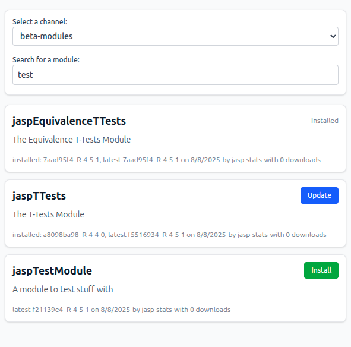

Welcome to JASP stats modules web app!

[](https://opensource.org/licenses/Apache-2.0)
[](https://biomejs.dev)
[](https://github.com/jasp-stats-modules/modules-app/actions/workflows/deploy.yml)
[](https://github.com/jasp-stats-modules/modules-app/actions/workflows/quality.yml)
[](https://fairsoftwarechecklist.net/v0.2?f=31&a=32113&i=22300&r=113)


A web application hosted at https://jasp-stats-modules.github.io/modules-app/ that allows you to search/filter all the available JASP modules and install them.

[](screenshot.png)

# Usage

## Search parameters

The web application is designed to be open from within JASP desktop application, but it can also be used as a standalone web application.

The JASP desktop application can tell the web application which version it is and which modules are installed by using search parameters (`?key=val`) in the URL.

- v: the version of the JASP desktop application for example `0.95.0`
- a: the architecture of the JASP desktop application for example `Windows_x86-64`
- i: installed modules. A JSON object with the module names as keys and their versions as values. The object has to be [URL encoded](https://developer.mozilla.org/en-US/docs/Web/JavaScript/Reference/Global_Objects/encodeURIComponent). For example, `{"22jaspEquivalenceTTests":"0.95.0","22jaspTTests":"0.94.0"}` becomes `%7B%2222jaspEquivalenceTTests%22%3A%220.95.0%22%2C%2222jaspTTests%22%3A%220.94.0%22%7D`.

A full URL could look like [https://jasp-stats-modules.github.io/modules-app/?a=Windows_x86-64&v=0.95.0&i=%7B%22jaspEquivalenceTTests%22%3A%220.95.0%22%2C%22jaspTTests%22%3A%220.94.0%22%7D](https://jasp-stats-modules.github.io/modules-app/?a=Windows_x86-64&v=0.95.0&i=%7B%22jaspEquivalenceTTests%22%3A%220.95.0%22%2C%22jaspTTests%22%3A%220.94.0%22%7D).

## Update list of modules

The list of modules can be updated by running the GitHub workflow at https://github.com/jasp-stats-modules/modules-app/actions/workflows/deploy.yml .
Use the "Run workflow" button to trigger the workflow manually.

# Architecture

The web application is a single page application (SPA) with the following characteristics:

- Built with [React](https://reactjs.org/) and [TypeScript](https://www.typescriptlang.org/)
- Uses [Vite](https://vitejs.dev/) as the build tool
- Uses [pnpm](https://pnpm.io/) as the package manager
- Uses [Tailwind CSS](https://tailwindcss.com/) for styling
- Uses [TanStack Router](https://tanstack.com/router) for routing, with an initial file-based router setup in `src/routes`
- Uses [biome](https://biomejs.dev/) for linting and formatting
- Fetches data from the [GitHub GraphQL API](https://docs.github.com/en/graphql) to get available JASP modules and their release assets

To get a list of available JASP modules, it does the following with the help of the `src/scrape.ts` script:

1. Fetches the git submodules of the https://github.com/jasp-stats-modules/modules-registry repository.
   - the directory in which a submodule is located is the channel
2. For each submodule in the latest release
   1. Fetches the release data
   2. Fetches the release assets ending with `.JASPModule` extension
   3. Looks in release description for the JASP version range the module is compatible with. The [version range](https://semver.npmjs.com/) is specified in front matter header as for example:
      ```markdown
      ---
      jasp: >=0.95.0
      ---
      ```
3. Saves data in `src/index.json` for the web application to use

# Getting Started

To run this application:

```bash
pnpm install
# Scrape a list of JASP module and their release assets from GitHub and save as src/index.json
export GITHUB_TOKEN=<your personal fine grained access token, only access to public repositories is needed and no other permissions>
pnpm scrape
pnpm start  
```

# Building For Production

To build this application for production:

```bash
pnpm scrape
pnpm build
```

## Testing

This project uses [Vitest](https://vitest.dev/) for testing. You can run the tests with:

```bash
pnpm test
```
